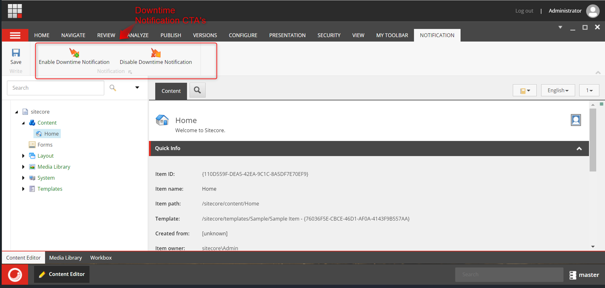
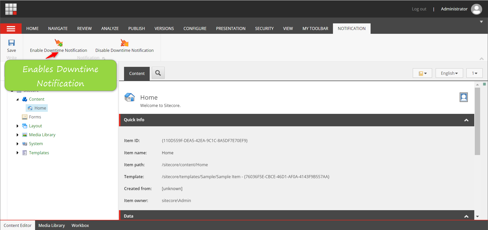
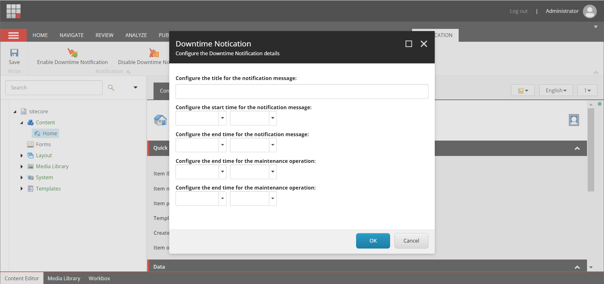
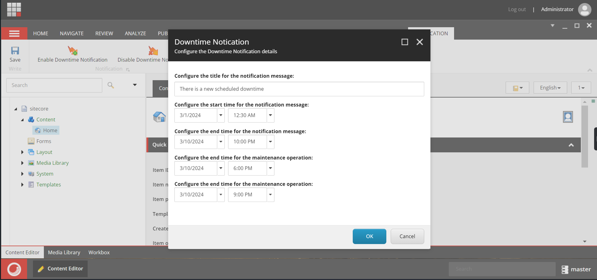
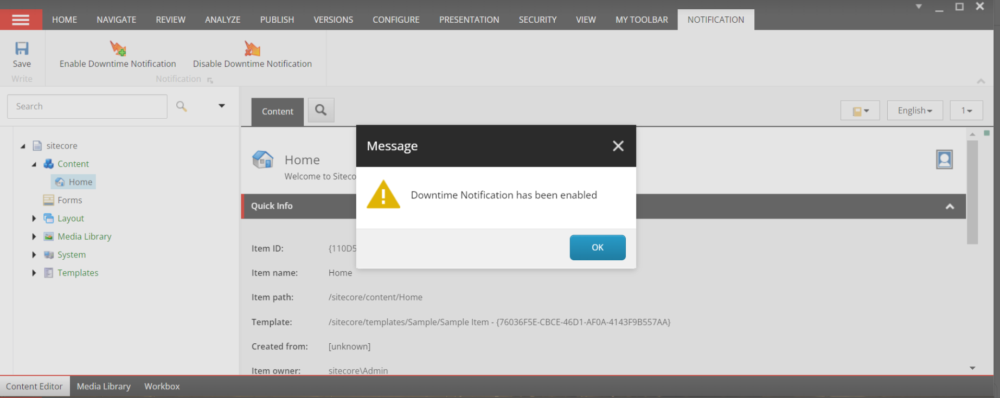
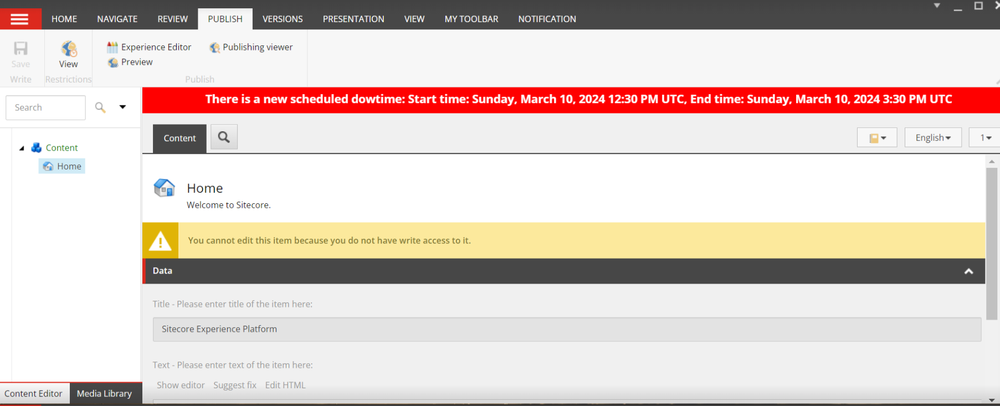
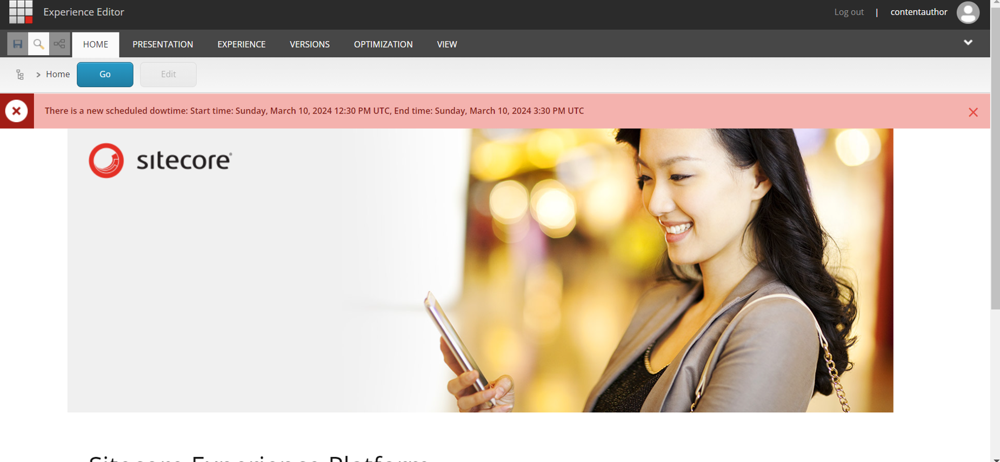
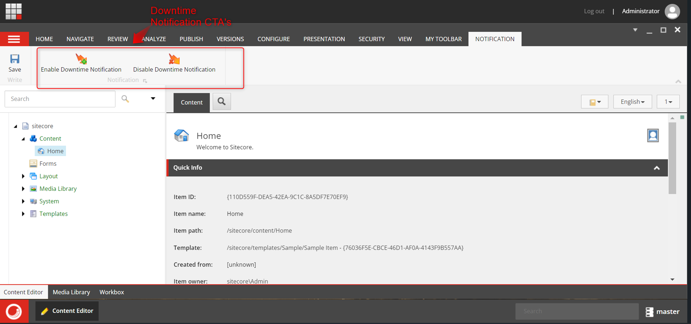
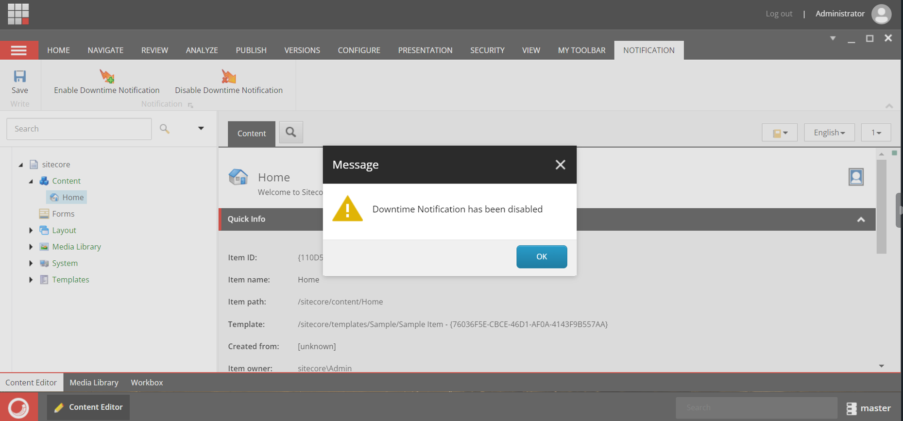

# Sitecore Hackathon 2024

## Team name

⟹ Tech Warriors

## Category

⟹ Best Module for XM/XP or XM Cloud

## Description

⟹ The "Downtime Notification Module" is indispensable for CM, proactively informing users, particularly content authors, about upcoming maintenance. By minimizing disruptions, preventing data loss, and ensuring compliance, this module fosters transparent communication and a seamless user experience. Its customization and scalability features further enhance adaptability to evolving system requirements

## Video link

⟹ Please find video for the module here:

⟹ [Replace this Video link](#video-link)

## Pre-requisites and Dependencies

⟹ Does your module rely on other Sitecore modules or frameworks?

-   Sitecore 10 or above
-   SXA
-   Sitecore CLI (Required for Content Serialization)

## Installation instructions

⟹ Write a short clear step-wise instruction on how to install your module.

Login to you XP Instance.

Install the SXA module - https://dev.sitecore.net/Downloads/Sitecore_Experience_Accelerator/10x/Sitecore_Experience_Accelerator_1030.aspx

Install Sitecore CLI - https://dev.sitecore.net/Downloads/Sitecore_CLI.aspx

Using the package installation wizard, install the Downtime Notification Module [Sitecore_Package/DowntimeNotification.zip ](https://github.com/Sitecore-Hackathon/2024-Tech-Warriors/blob/main/Sitecore_Package/DowntimeNotification.zip)

# Usage instructions

1.To set the Notification Message, click on the "Notification" CTA from the ribbon:

2.Next, to enable the downtime notifications click on "Enable Downtime Notification", this will open up pop up for you as shown.

fill up this details as per your scheduled deployment activity.

once details are filled click OK. User will be notified with the confirmation message on successfull creation of notification.

3. As per details set for the notification message, content authoring users will be shown a notification message on content editor as well as experience editor.

    

    

4. To Disable the notification click on "Disable Downtime Notification" as shown in ribbon

    

on successful removal of notification user will be shown success popup

# Contents of DowntimeNotification Package

1. Core database

    - \sitecore\content\Applications\Content Editor\Ribbons\Chunks\DowntimeNotification
    - \sitecore\content\Applications\Content Editor\Ribbons\Ribbons\Default\Notification
    - sitecore\content\Applications\Content Editor\Ribbons\Strips\Notification

2. Master Database

    - \sitecore\system\Settings\Feature\TechWarriors
    - \sitecore\templates\Feature\TechWarriors

3. Files

    - App_config/Include/Feature/z.Feature.Downtime.config
    - bin/DowntimeNotification.dll
    - sitecore/shell/Applications/Content Manager/Dialogs/DowntimeNotification/DowntimeNotification.xml
	- sitecore/shell/Applications/Content Manager/Dialogs/notification.js
