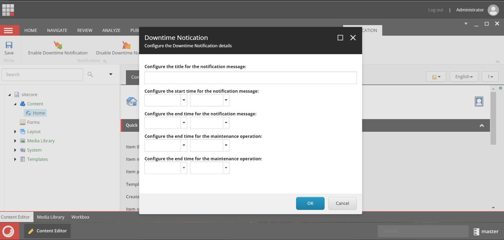

## Team name

⟹ Tech Warriors

## Category

⟹ Best Module for XM/XP or XM Cloud

## Description

⟹ The "Downtime Notification Module" is indispensable for CM, proactively informing users, particularly content authors, about upcoming maintenance. By minimizing disruptions, preventing data loss, and ensuring compliance, this module fosters transparent communication and a seamless user experience. Its customization and scalability features further enhance adaptability to evolving system requirements

## Video link

⟹ Provide a video highlighing your Hackathon module submission and provide a link to the video. You can use any video hosting, file share or even upload the video to this repository. _Just remember to update the link below_

⟹ [Replace this Video link](#video-link)

## Pre-requisites and Dependencies

⟹ Does your module rely on other Sitecore modules or frameworks?

Sitecore XP
SXA

_Remove this subsection if your entry does not have any prerequisites other than Sitecore_

## Installation instructions

⟹ Write a short clear step-wise instruction on how to install your module.

> In a Sitecore XP Instance

Install the SXA module
Using the package installation wizard, install the Downtime Notification Module (link)
Using the package installation wizard, install the Downtime Notification Module (link)

Usage instructions

1. We need to set up details for the scheduled deploymnet activity details.
   

Contents of Downtime Notification Module

Contents of Downtime Notification Module package
