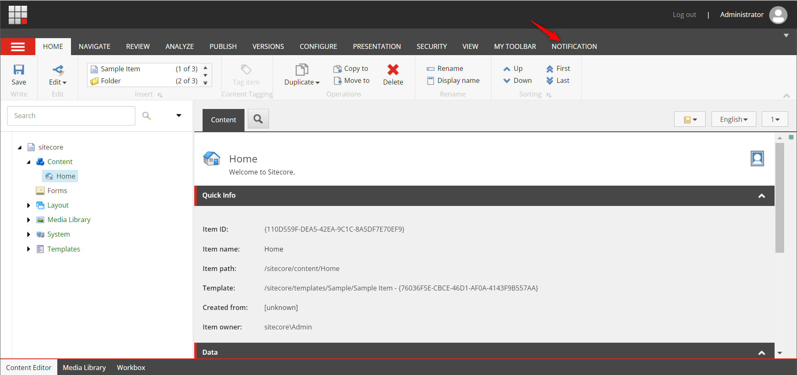
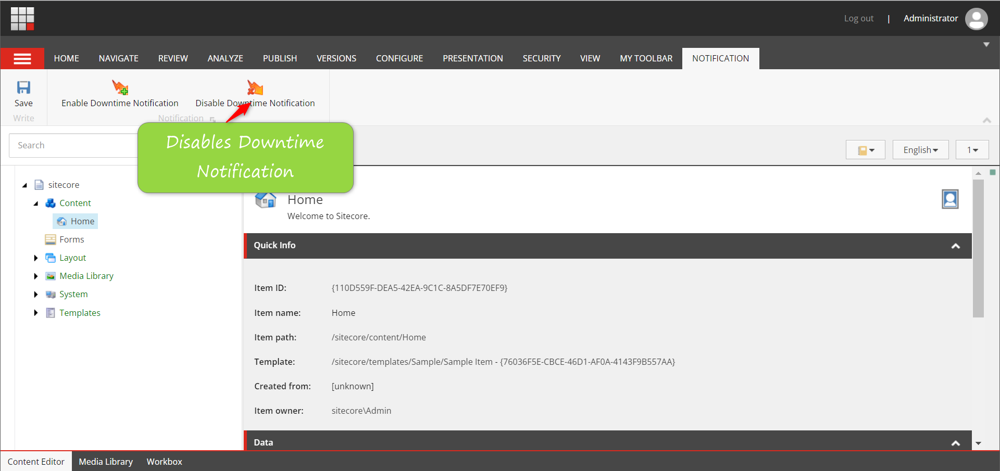

## Team name

⟹ Tech Warriors

## Category

⟹ Best Module for XM/XP or XM Cloud

## Description

⟹ The "Downtime Notification Module" is indispensable for CM, proactively informing users, particularly content authors, about upcoming maintenance. By minimizing disruptions, preventing data loss, and ensuring compliance, this module fosters transparent communication and a seamless user experience. Its customization and scalability features further enhance adaptability to evolving system requirements

## Video link

⟹ Provide a video highlighing your Hackathon module submission and provide a link to the video. You can use any video hosting, file share or even upload the video to this repository. _Just remember to update the link below_

⟹ [Replace this Video link](#video-link)

## Pre-requisites and Dependencies

⟹ Does your module rely on other Sitecore modules or frameworks?

Sitecore 10 or above -https://dev.sitecore.net/Downloads/Sitecore_Experience_Platform/103/Sitecore_Experience_Platform_103_Update1.aspx
SXA
Sitecore CLI

## Installation instructions

⟹ Write a short clear step-wise instruction on how to install your module.

> In a Sitecore XP Instance

Install the SXA module-https://dev.sitecore.net/Downloads/Sitecore_Experience_Accelerator/10x/Sitecore_Experience_Accelerator_1030.aspx
Install Sitecore CLI https://dev.sitecore.net/Downloads/Sitecore_CLI.aspx
Using the package installation wizard, install the Downtime Notification Module (link)

Usage instructions

1.To set Notification Message click on the "Notification" from the ribbon:

2.To enable the downtime notifications click on "Enable Downtime Notification", this will open up pop up for you as shown.

fill up this details as per your scheduled deployment activity.

once details are filled click OK. User will be notified with the confirmation message on succesfull cretion of notification.

3. As per details set for the notification message CM users will be shown a notification message
   

4. To Disable the notification click on "Disable Downtime Notification" as shown in ribbon
   

on successful removal of notification user will be shown success popup

